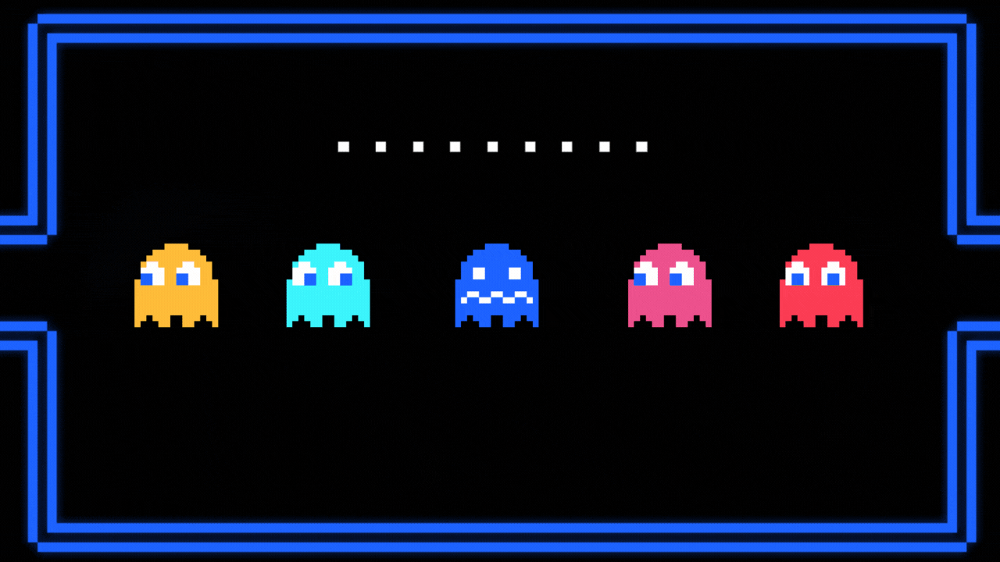
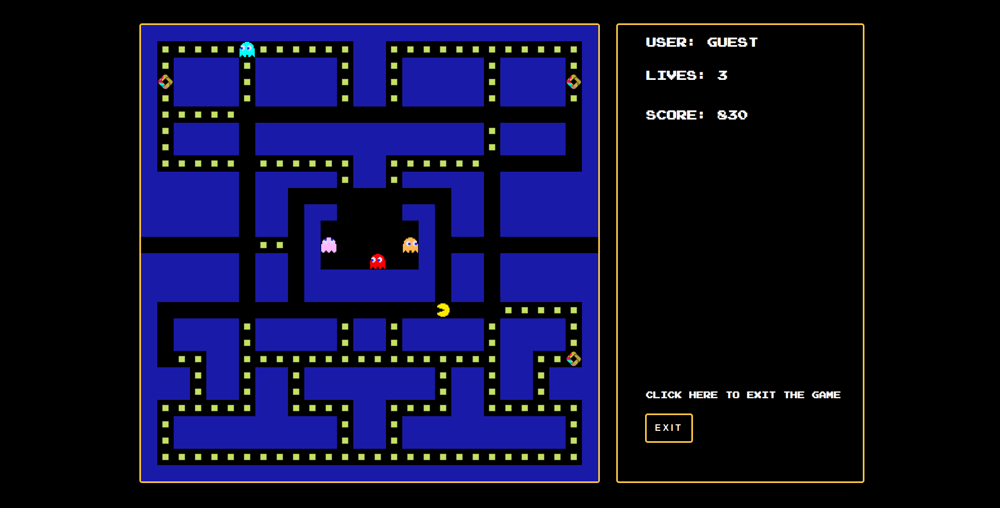
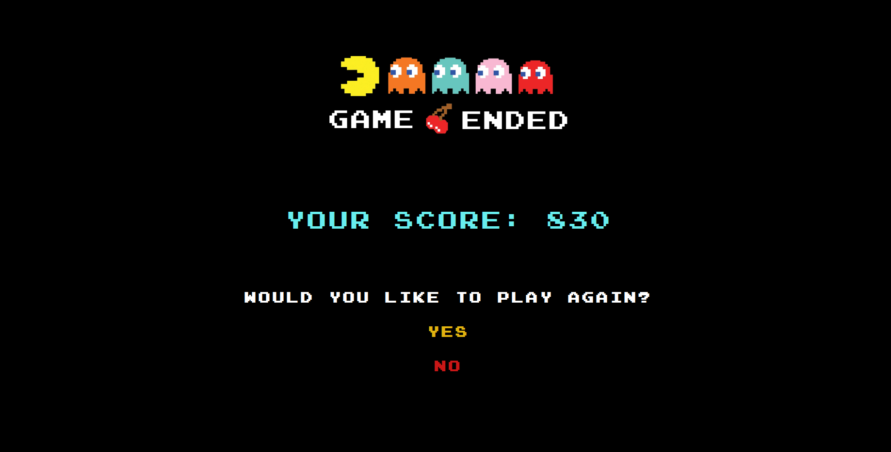
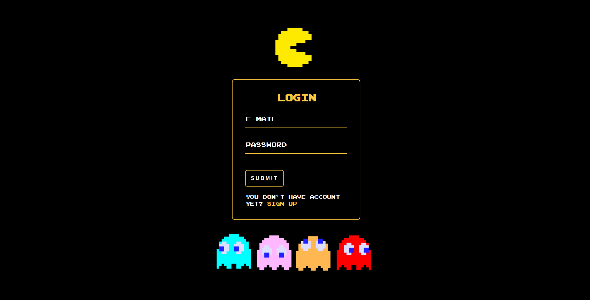
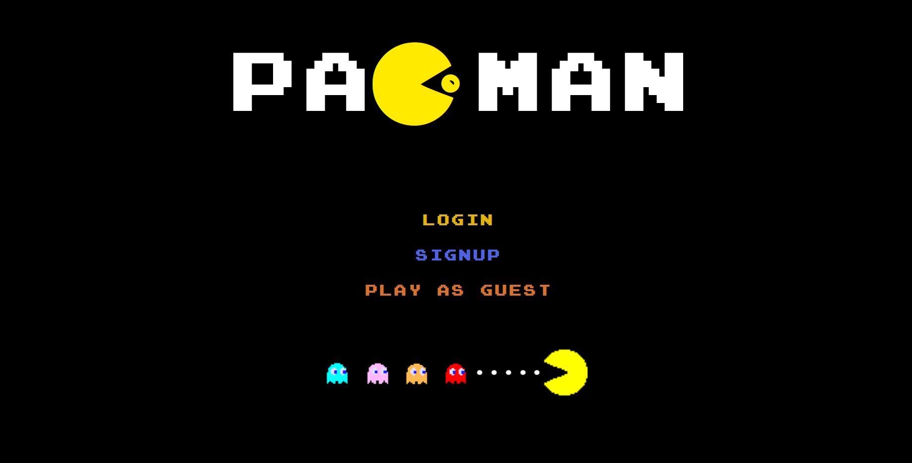
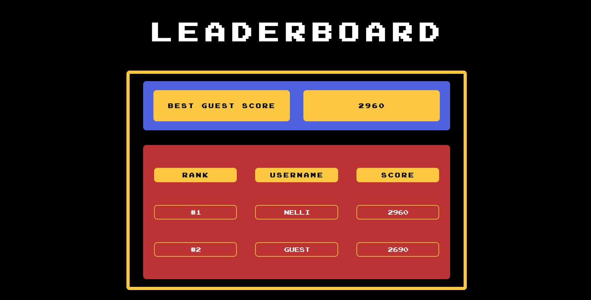

# Pac-Man: A fun JavaScript school project

## Project Description

This is a minimal implementation of the Pacman game with only one level and without ghosts strategy,
which was done as a school project with a three-member team in one week.
There is a web application with a login system built around the game with Flask, using a PostgreSQL database.

## Game Features

- Animated movement (random for ghosts)
- Scared ghosts
- Respawning enemies
- Edible pac dots
- Edible power pellets
- Score system
- Game over

## App Features

- Sign up
- Log in / log out
- Menu
- Leaderboard

## Technologies

- JavaScript
- Python
- Flask
- Jinja
- PostgreSQL
- psycopg2
- HTML
- CSS
- PyCharm

## Future development

- Fix game logic (all power pellet eaten, respawn)
- Ghosts movement algorithm (follow, attack)
- Additional levels?

## Wins & Challenges

### Wins
- Worked well as a team with assignment of tasks evenly.
- Understood DOM manipulation, event handlers (e.g. through user interactions).
- Managed to implement the basic features of the game and the related app features in 4 days.

### Challenges
- Implementing movements was very difficult to grasp at the beginning as DOM manipulation was 
a completely new concept we were exposed to.

